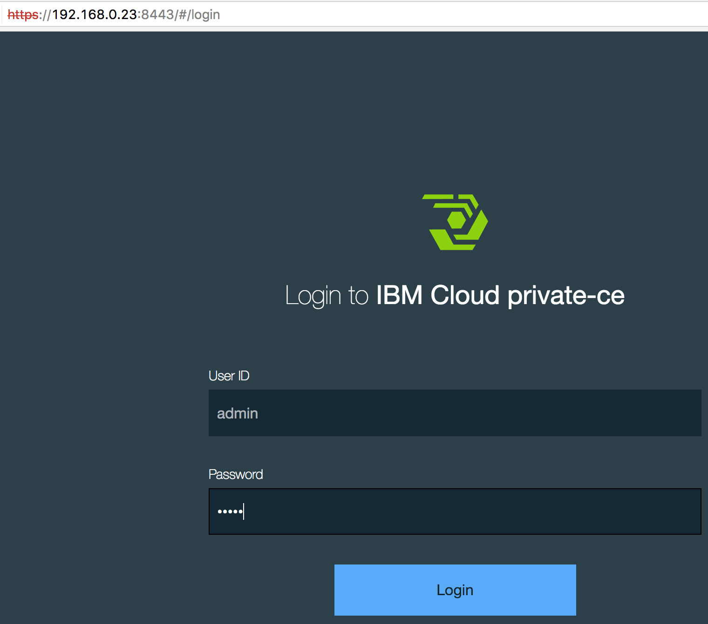
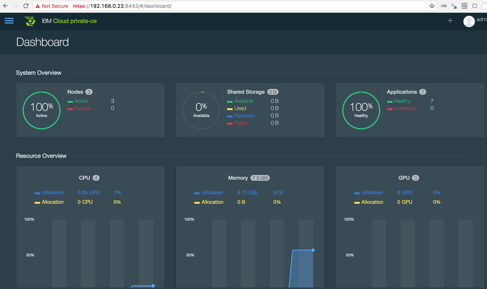

# ICP_Local_Install
I followed the instructions and resources provided in "https://hub.docker.com/r/ibmcom/cfc-installer/?cm_mc_uid=34158262147114835231232&cm_mc_sid_50200000=" to build my very first ICP in local environment, and I decided to summarize the notes and walkthrough into the following sections so others can have a quick jumpstart.

Notation: 
{boot-node-ip} --> to be replaced by boot-node's ip 
$ --> command prompt, indicates start of a command

## Precondition
Have Vagrant(https://www.vagrantup.com/downloads.html) and VirtualBox(https://www.virtualbox.org/wiki/Downloads) installed. 
Have your notebook connected to wifi. 
The following commands can be applied to Mac or Linux straightaway and may need some modifications for Windows. 
You have 16GB of RAM.

## Prepare Vagrant image and VirtualBox VM:
Under the "Vagrant" folder, there are 5 sub-folders namely: 
microservice-builder-base: this is the base image for rest of the VirtualBox VM 
boot-node: refer to "https://www.ibm.com/support/knowledgecenter/SSBS6K_1.2.0/getting_started/architecture.html" for Boot Node 
master-node: refer to "https://www.ibm.com/support/knowledgecenter/SSBS6K_1.2.0/getting_started/architecture.html" for Master Node 
proxy-node: refer to "https://www.ibm.com/support/knowledgecenter/SSBS6K_1.2.0/getting_started/architecture.html" for Proxy Node 
worker-node: refer to "https://www.ibm.com/support/knowledgecenter/SSBS6K_1.2.0/getting_started/architecture.html" for Worker Node 

Assuming "{ICP_Local_Install}" is our working directory already, first of all, we need to build the base image with the following commands: 
$ cd {ICP_Local_Install}/vagrant/microservice-builder-base && vagrant up 
This may take several to 1x minutes depends on the network speed. 
$ vagrant package --base microservice-builder-base --output microservice-builder-base.box 
$ vagrant box add microservice-builder-base microservice-builder-base.box 
This will store the newly created VM as a vagrant image, and now it's safe to remove the transitional VM with the following command. 
$ vagrant destroy -f 

Next we can start building VMs for boot-node, master-node, proxy-node, and worker-node with following commands one at a time. 
$ cd {ICP_Local_Install}/vagrant/boot-node && vagrant up 
$ cd {ICP_Local_Install}/vagrant/master-node && vagrant up 
$ cd {ICP_Local_Install}/vagrant/proxy-node && vagrant up 
$ cd {ICP_Local_Install}/vagrant/worker-node && vagrant up 

Now infrastructure is ready, and the only thing left to do before install ICP is to ensure the connectivity among these nodes. 

### Ensure Connectivity Among Nodes
Reteive IP addresses of all four nodes by running the following commands one at a time and take note of the IP for eth1. 
$ cd {ICP_Local_Install}/vagrant/boot-node && vagrant ssh -c "ifconfig eth1" 
$ cd {ICP_Local_Install}/vagrant/master-node && vagrant ssh -c "ifconfig eth1" 
$ cd {ICP_Local_Install}/vagrant/proxy-node && vagrant ssh -c "ifconfig eth1" 
$ cd {ICP_Local_Install}/vagrant/worker-node && vagrant ssh -c "ifconfig eth1" 

### Configure the IP addresses into boot-node and setup boot-node into a DNS server. 
$ cd {ICP_Local_Install}/vagrant/boot-node && \\ 
vagrant ssh -c "sudo su -c 'echo {master-node-ip} master-node master-node >> /etc/hosts'" && \\ 
vagrant ssh -c "sudo su -c 'echo {master-node-ip} master.cfc master.cfc >> /etc/hosts'" && \\ 
vagrant ssh -c "sudo su -c 'echo {proxy-node-ip} proxy-node proxy-node >> /etc/hosts'" && \\ 
vagrant ssh -c "sudo su -c 'echo {worker-node-ip} worker-node worker-node >> /etc/hosts'"

Restart the DNS server running on boot-node 
$ vagrant ssh -c "sudo su -c 'systemctl restart dnsmasq'"

### Configure master-node, proxy-node, worker-node to resolve domain name with boot-node's DNS server 
$ cd {ICP_Local_Install}/vagrant/master-node && \\ 
vagrant ssh -c "sudo su -c 'echo nameserver {boot-node-ip} > /etc/resolv.tmp'" && \\ 
vagrant ssh -c "sudo su -c 'cat /etc/resolv.conf >> /etc/resolv.tmp'" && \\ 
vagrant ssh -c "sudo su -c 'mv /etc/resolv.tmp /etc/resolv.conf'" 
$ cd {ICP_Local_Install}/vagrant/proxy-node && \\ 
vagrant ssh -c "sudo su -c 'echo nameserver {boot-node-ip} > /etc/resolv.tmp'" && \\ 
vagrant ssh -c "sudo su -c 'cat /etc/resolv.conf >> /etc/resolv.tmp'" && \\ 
vagrant ssh -c "sudo su -c 'mv /etc/resolv.tmp /etc/resolv.conf'" 
$ cd {ICP_Local_Install}/vagrant/worker-node && \\ 
vagrant ssh -c "sudo su -c 'echo nameserver {boot-node-ip} > /etc/resolv.tmp'" && \\ 
vagrant ssh -c "sudo su -c 'cat /etc/resolv.conf >> /etc/resolv.tmp'" && \\ 
vagrant ssh -c "sudo su -c 'mv /etc/resolv.tmp /etc/resolv.conf'"

### Retrieve SSH public key from boot-node and configure the key into master, proxy, worker node, so we won't be asked for password during ICP installation process 
$ cd {ICP_Local_Install}/vagrant/boot-node 
$ vagrant ssh -c "sudo su -c 'echo -e  \\"y\\n\\"|ssh-keygen -b 4096 -t rsa -f ~/.ssh/id_rsa -P \\"\\" -C \\"\\"'" 
$ vagrant ssh -c "sudo su -c 'cat ~/.ssh/id_rsa.pub'" 
Copy everything between "ssh-rsa" and "==" inclusive (aka. {SSH_PUBLIC_KEY}) into a notepad, we need this rightaway. 

Configure boot-node's key into master node 
$ cd {ICP_Local_Install}/vagrant/master-node && \\ 
vagrant ssh -c "sudo su -c 'mkdir -p ~/.ssh/'" && \\ 
vagrant ssh -c "sudo su -c 'echo {SSH_PUBLIC_KEY} >> ~/.ssh/authorized_keys'" && \\ 
vagrant ssh -c "sudo su -c 'chmod 400 ~/.ssh/authorized_keys'"

Configure boot-node's key into proxy node 
$ cd {ICP_Local_Install}/vagrant/proxy-node && \\ 
vagrant ssh -c "sudo su -c 'mkdir -p ~/.ssh/'" && \\ 
vagrant ssh -c "sudo su -c 'echo {SSH_PUBLIC_KEY} >> ~/.ssh/authorized_keys'" && \\ 
vagrant ssh -c "sudo su -c 'chmod 400 ~/.ssh/authorized_keys'"

Configure boot-node's key into worker node 
$ cd {ICP_Local_Install}/vagrant/worker-node && \\ 
vagrant ssh -c "sudo su -c 'mkdir -p ~/.ssh/'" && \\ 
vagrant ssh -c "sudo su -c 'echo {SSH_PUBLIC_KEY} >> ~/.ssh/authorized_keys'" && \\ 
vagrant ssh -c "sudo su -c 'chmod 400 ~/.ssh/authorized_keys'"

Test Connectivity From Boot-Node 
$ cd {ICP_Local_Install}/vagrant/boot-node 
$ vagrant ssh -c "sudo su -c 'ssh root@master-node'" 
$ exit 
$ vagrant ssh -c "sudo su -c 'ssh root@proxy-node'" 
$ exit 
$ vagrant ssh -c "sudo su -c 'ssh root@worker-node'" 
$ exit

## Install ICP From Boot-Node
SSH into boot-node as root and start to install ICP. The latest version we are using is 1.2.0 refered to "https://www.ibm.com/support/knowledgecenter/SSBS6K_1.2.0/installing/install_containers_CE.html" 
$ cd {ICP_Local_Install}/vagrant/boot-node 
$ vagrant ssh -c "sudo su -" 
$ docker pull ibmcom/cfc-installer:1.2.0 
$ docker run -e LICENSE=accept --rm -v "$(pwd)":/data ibmcom/cfc-installer:1.2.0 cp -r cluster /data 
$ cp ~/.ssh/id_rsa cluster/ssh_key 
$ echo [master] > cluster/hosts && \\ 
echo {master-node-ip} >> cluster/hosts && \\ 
echo [worker] >> cluster/hosts && \\ 
echo {worker-node-ip} >> cluster/hosts && \\ 
echo [proxy] >> cluster/hosts && \\ 
echo {proxy-node-ip} >> cluster/hosts

By entering the following (last) command, ICP installation is commenced: 
$ cd cluster && docker run -e LICENSE=accept --net=host --rm -t -v "$(pwd)":/installer/cluster ibmcom/cfc-installer:1.2.0 install 
After a successful installation, we should see something like following prompts up in terminal.

Now let's open up the "UI URL" in browser to take a look at ICP's dashboard

